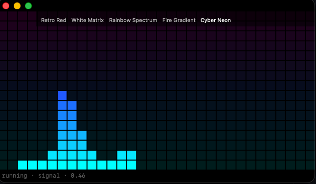

<p align="center">
  
</p>

<h1 align="center">eqviz</h1>

<p align="center">
  Un visor gráfico de audio en tiempo real para macOS.<br />
  Barras segmentadas, pinta vintage, livianito.<br />
  <em>No es un equalizer: no toca el sonido, lo mira.</em>
</p>

<p align="center">
  
  
  
  <a href="LICENSE"></a>
</p>

<p align="center">
  
  
  
  
  
</p>

---

Lo armé una mañana de licencia. Sin fiebre, un poquito de THC, música puesta. Quería un visor como los equipos vintage de mi viejo — los VU, los LEDs, esa cosa de hi-fi de living que parece tablero de avión.

Sigue siendo un PoC y le voy a ir toqueteando cosas. Esto es un **lab público**: roadmap, invariantes, prompts al agente. No es un producto de App Store. Es lo que salió de esa mañana.

### Mood

Estaba (estoy) escuchando **Cassettes**, la playlist con la música de los cassettes de mi viejo.

[Cassettes en Spotify](https://open.spotify.com/playlist/5Ge72ozP9x4JMIkllf7Aej?si=7fe0e815c3df4929)

<iframe data-testid="embed-iframe" style="border-radius:12px" src="https://open.spotify.com/embed/playlist/5Ge72ozP9x4JMIkllf7Aej?utm_source=generator&theme=0&si=7fe0e815c3df4929" width="100%" height="152" frameBorder="0" allowfullscreen="" allow="autoplay; clipboard-write; encrypted-media; fullscreen; picture-in-picture" loading="lazy"></iframe>

---

## Spec

| pieza | detalle |
| :--- | :--- |
| Grilla | 32 × 16 segmentos |
| Reloj | 60 Hz, solo celdas prendidas |
| Captura | entrada default de la Mac |
| Paletas | 5, hover para cambiar |
| Stack | Swift + SwiftUI · Python/`uv` solo tooling |

> [!NOTE]
> Pide el mic. **No graba ni manda audio** — entra, FFT, se tira.
> `eqviz does not record or send audio.`

> [!WARNING]
> PoC: bundle `dev.local.eqviz`, Personal Team, **sandbox off**.
> Si clonás y corrés, es una app sin sandbox que pide el mic.

## Cómo se prende

Instalá vos **Xcode 15+** y [XcodeGen](https://github.com/yonaskolb/XcodeGen). El Team ID no va en git.

```bash
./setup.sh            # menú
./setup.sh status
./setup.sh test-mac
./setup.sh run
```

| paso | cómo |
| :--- | :--- |
| Primera vez | `./setup.sh xcode` → Signing → **Personal Team** |
| Plugins de xcodebuild | `xcodebuild -runFirstLaunch` |
| Parar | `./setup.sh stop` pregunta `y/N` — no `pkill` |
| Audio | otorgá el mic y mandale señal a la entrada del sistema |

## El lab

| Path | Qué es |
| :--- | :--- |
| `macos/eqviz/` | la app |
| `macos/eqvizTests/` | tests de lógica (sin mic) |
| `roadmap/` | prompts en orden — agentes: [`00-invariants.md`](roadmap/00-invariants.md) |
| `./setup.sh next` | el siguiente paso pendiente |

```bash
./setup.sh next
uv sync --group dev
```

Config local: `.env.example` → `.env`, y no lo subas.

## Licencia

[CC BY 4.0](https://creativecommons.org/licenses/by/4.0/) — usalo, forkéalo, rompelo. **Citá la fuente:** [hbauzan/eqviz](https://github.com/hbauzan/eqviz). Texto legal en [`LICENSE`](LICENSE).
